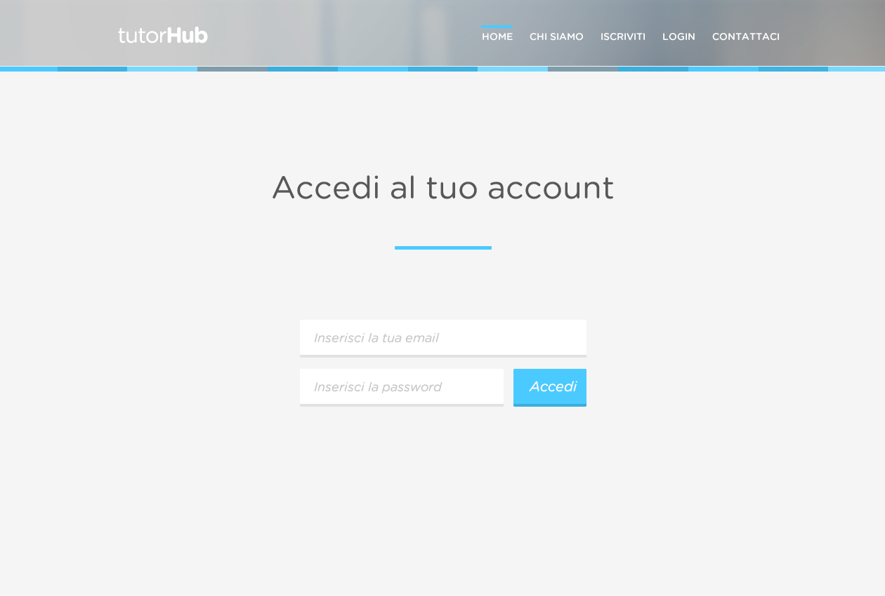
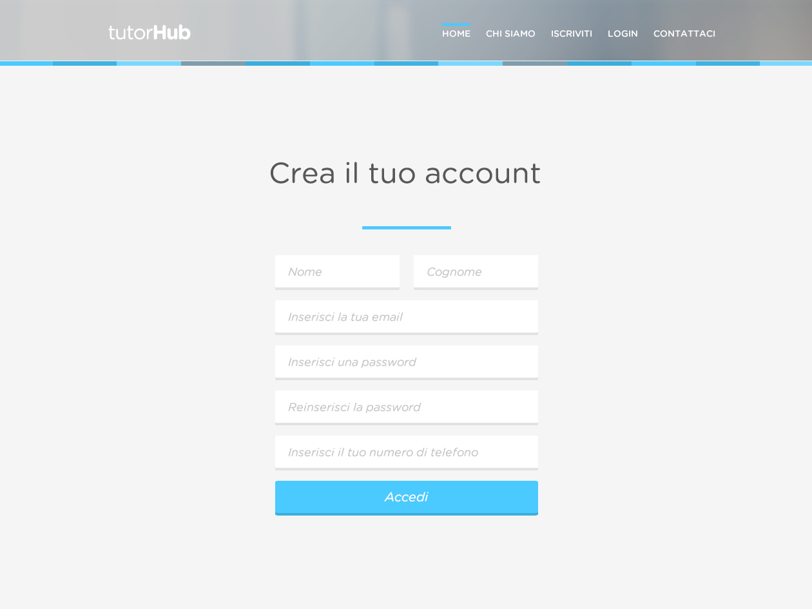

### TutorHub

Simple Web App that connects **students** to **tutors** developed as a course project @UNIPD.

### Running locally / demo

- Install `docker` and `docker-compose`
- Run `docker-compose up`
- open `localhost:8081` and import database (`tutorhub.sql`) in phpmyadmin
- View the app at `localhost:8080`
### Screenshots

